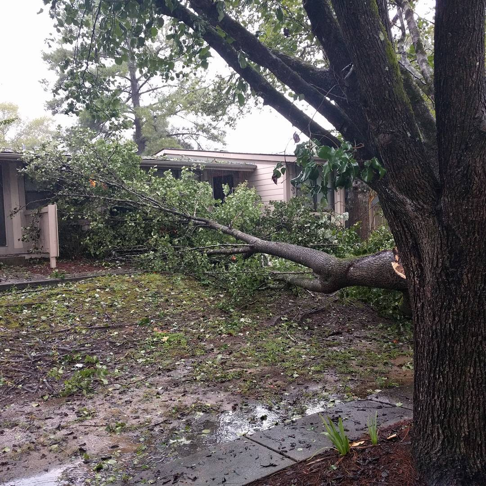
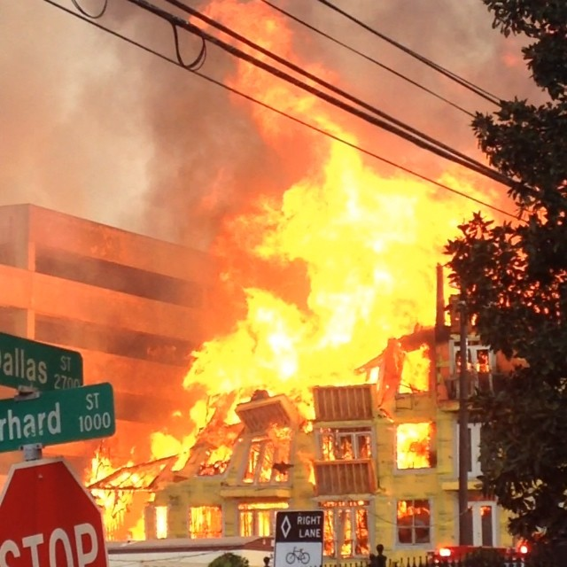

# Identifying the category of category of disasters from damage images

This project is a step towards disaster rescue efforts in the aftermath of a major disaster - natural or man-made. It aims to classify the category of the disaster and help first responders equip themselves with better tool, especially in remote or rural areas outside the vicinity of towns and cities. There are six categories, five positives - infrastructure, nature, fires, flood, human-damage and a negative class with no damage. The dataset is composed of 5879 images containing 640x640 images and was broken into ~5000:800 for training and validation. Random data augmentation techniques were applied for making the model robust to unseen samples. Below are two images belonging to nature and fires.

## Sample Images

           

## Networks used for inference 

Two models were trained on the dataset -  a pre-trained VGG16 on ImageNet and a custom CNN trained from scratch. While the pre-trained gave better performance, the custom CNN took a lot less time to give optimal performance while not being too far behind a large VGG network in terms of accuracy. The ablation studies performed showed that bigger badder networks don't always give best results and is highly dataset dependant and the number of classes.

## Frameworks Used

* Tensorflow backend (1.13)
* Keras 2.2.4

